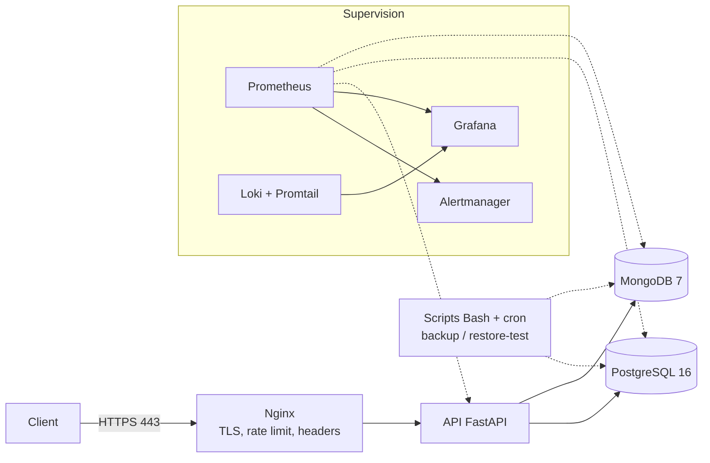

# Production-Ready Stack
Stack Docker Compose « type production » : **Nginx** (HTTPS, rate limiting) devant une API, avec
**PostgreSQL** et **MongoDB**,
des **sauvegardes Bash automatisées dont la restauration est testée**, du **monitoring** (Prometheus,
Grafana, Alertmanager),
des **logs centralisés** (Loki) et des **incidents simulés avec post-mortems**.
> L'API est volontairement minimale (6 routes). Le projet porte sur l'**exploitation** : fiabilité,
supervision, reprise après incident.

## Architecture

Trois réseaux Docker : `frontend` (Nginx, API), `backend` (API, bases, exporters ; **interne**, sans
accès Internet),
`monitoring`. Les bases ne publient aucun port ; Grafana, Prometheus et Alertmanager n'écoutent que sur
`127.0.0.1`.
## Démarrage rapide
Prérequis : Docker Engine + plugin Compose, `make`, `openssl`.
```bash
git clone https://github.com/gharbiimohamed9-blip/prod-ready-stack.git && cd prod-ready-stack
chmod +x scripts/*.sh postgres/init/*.sh mongo/init/*.sh
make up # crée .env (mots de passe aléatoires), le certificat TLS, puis démarre tout
make ps # tous les services doivent être "healthy" / "running"
```
| Service | URL |
|---|---|
| API (via Nginx) | https://localhost (certificat auto-signé : `curl -k`) |
| Documentation OpenAPI | https://localhost/docs |
| Grafana | http://localhost:3000 (identifiants affichés par `make up`, ou dans `.env`) |
| Prometheus | http://localhost:9090 |
| Alertmanager | http://localhost:9093 |
```bash
curl -sk https://localhost/health
curl -sk -X POST https://localhost/users -H 'Content-Type: application/json' -d
'{"name":"Ali","email":"ali@example.com"}'
curl -sk -X POST https://localhost/events -H 'Content-Type: application/json' -d
'{"type":"login","payload":{"user":"ali"}}'
## Ce que démontre ce projet
| Compétence | Où le voir |
|---|---|
| Nginx : reverse proxy, TLS, rate limiting, en-têtes de sécurité, DNS dynamique |
`nginx/conf.d/default.conf` |
| PostgreSQL : rôle à privilèges minimaux, plan d'exécution et index | `postgres/init/01-init.sh`, `make
perf-demo` |
| MongoDB : utilisateurs par rôle, index, dump/restore | `mongo/init/01-init.sh`,
`scripts/backup_mongo.sh` |
| Bash : `set -euo pipefail`, traps, rétention, codes de sortie, ShellCheck | `scripts/` |
| Sauvegardes **testées** (restauration dans un conteneur jetable) | `scripts/restore_test.sh` |
| Monitoring et alerting | `monitoring/prometheus/alerts.yml`, dashboard Grafana |
| Logs centralisés (JSON Nginx -> Loki) | `monitoring/promtail/`, `monitoring/loki/` |
| Résolution d'incidents et post-mortems | `docs/incidents/`, `docs/runbook.md` |
| CI | `.github/workflows/ci.yml` |
## Sauvegardes
```bash
make backup # pg_dump + mongodump compressés, horodatés, rétention 7 jours
make restore-test # restaure la dernière sauvegarde dans des conteneurs jetables et compte les
données
make cron # planifie : 02:00 backup PostgreSQL, 02:05 backup MongoDB, 02:30 test de
restauration
```
## Alertes configurées
| Alerte | Condition |
|---|---|
| `TargetDown` | une cible Prometheus ne répond plus (30 s) |
| `PostgresDown` / `MongoDown` | base inaccessible pour son exporter |
| `DiskUsageHigh` | disque `/` utilisé à plus de 80 % |
| `PostgresTooManyConnections` | plus de 80 % de `max_connections` |
| `ApiServerErrors` | présence de réponses 5xx |
Les alertes sont envoyées par webhook à un petit récepteur (`alert-logger`) dont les logs sont visibles
dans Loki.
## Incidents simulés
| Incident | Détection | Résolution | Durée mesurée |
|---|---|---|---|
| [INC-001](docs/incidents/INC-001-postgres-down.md) PostgreSQL arrêté | alerte `PostgresDown` | `docker
start` | ___ s |
| [INC-002](docs/incidents/INC-002-drop-table.md) `DROP TABLE` accidentel | alerte `ApiServerErrors` |
restauration depuis sauvegarde | ___ s |
| [INC-003](docs/incidents/INC-003-api-down-502.md) API arrêtée (502) | alerte `TargetDown` + logs Nginx
| `docker start` | ___ s |
## Captures d'écran
Dashboard Grafana, alerte dans Alertmanager, logs Loki : voir `docs/img/`.
## Limites connues et pistes d'amélioration
- Certificat auto-signé (Let's Encrypt sur un vrai domaine) ; un seul noeud, donc pas de haute
disponibilité.
- Sauvegardes logiques sur le même disque : ajouter une copie hors machine (rsync, objet S3).
